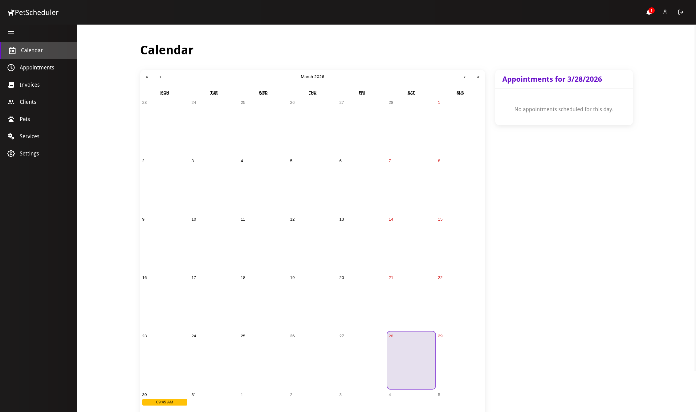
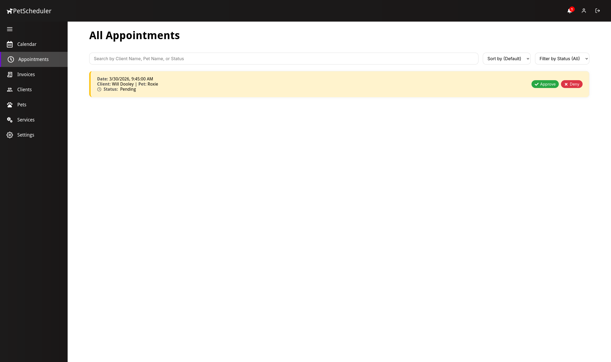
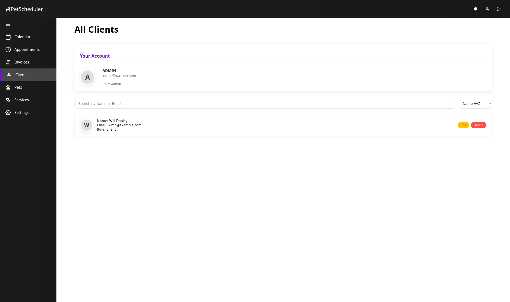
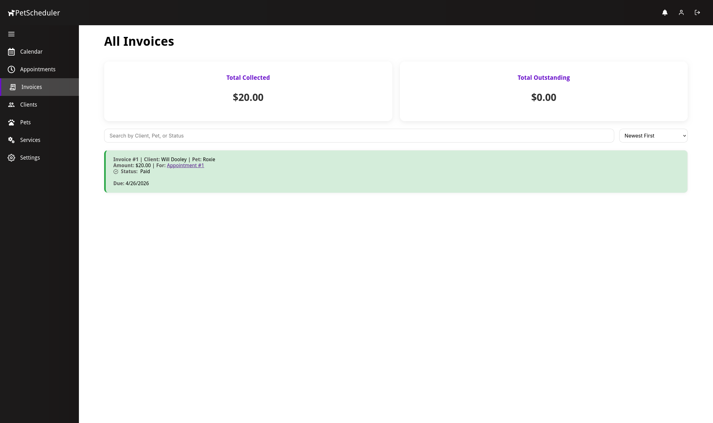
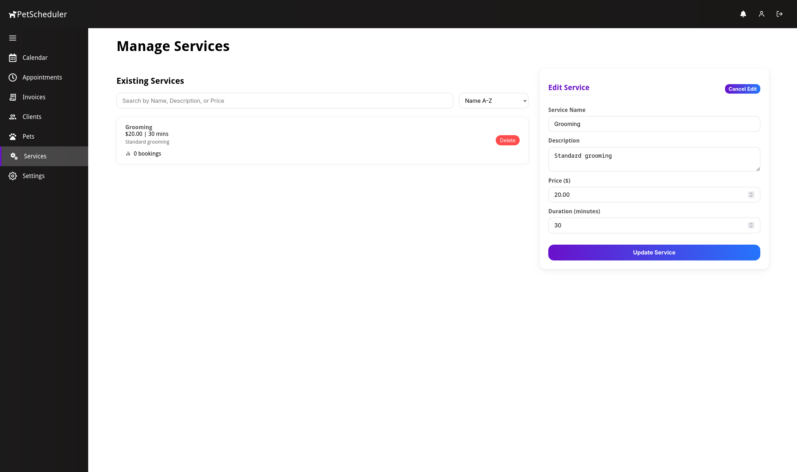
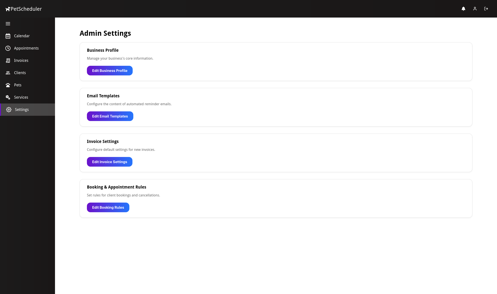
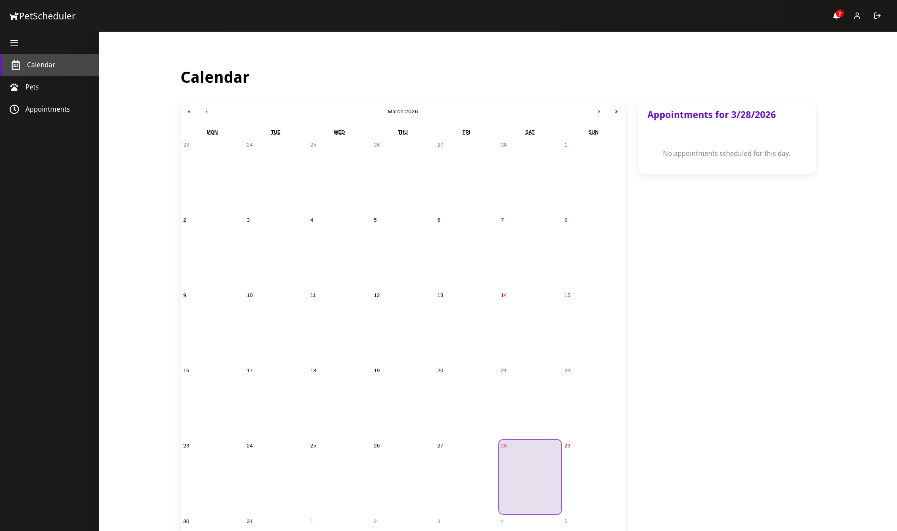
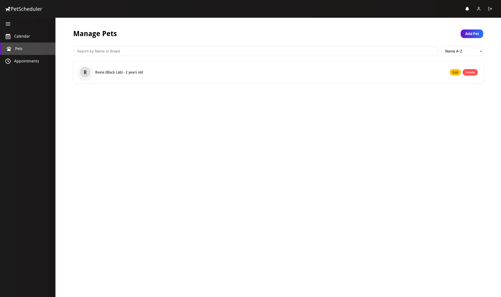
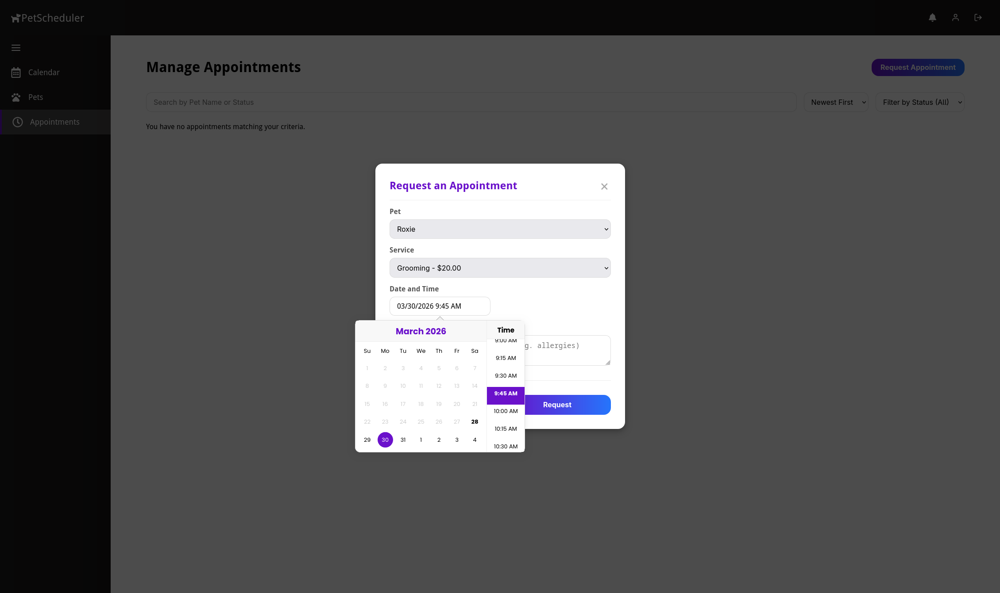

# Pet Scheduler Application

A full-stack web application for managing pet grooming or care businesses — handling clients, pets, appointments, services, invoices, and automated email reminders.

---

## Screenshots

These screenshots are just some of the pages for each role.

| Admin Pages |
|-----------|
|  |
|  |
|  |
|  |
|  |
|  |

| Client Pages |
|-----------|
|  |
|  |
|  |


---

## Features

**Admin**
- Calendar view with appointment scheduling and filtering
- Full client and pet management with photo uploads
- Service catalog with pricing and duration
- Invoice creation and tracking with email notifications
- Customizable business profile, booking rules, and email templates
- Appointment status tracking (Scheduled, Pending, Completed, Canceled)

**Client Portal**
- Self-registration and profile management
- Pet profiles with photos
- Appointment request and history
- In-app notifications and email reminders (24h and 1h before appointments)

**General**
- JWT-based authentication with role-based access (Admin / Client)
- Email reminder system via Nodemailer
- File upload with SHA-256 hash-based deduplication
- Dockerized deployment with Nginx, Node.js, and PostgreSQL
- Docusaurus-powered documentation site

---

## Tech Stack

| Layer | Technology |
|-------|-----------|
| Frontend | React 19, React Router 7, Axios, react-calendar, date-fns |
| Backend | Node.js 20, Express 4, PostgreSQL 13, JWT, bcrypt, Multer |
| Email | Nodemailer (SMTP / Gmail App Password) |
| Serving | Nginx (production frontend) |
| Docs | Docusaurus |
| Containers | Docker, Docker Compose |

---

## Project Structure

```
Pet-Scheduler-Application/
├── backend/
│   ├── routes/             # Express route handlers
│   ├── middleware/         # Auth and validation middleware
│   ├── uploads/            # Uploaded files (photos)
│   ├── server.js           # Main Express server
│   ├── db.js               # PostgreSQL connection
│   ├── schema.sql          # Database schema
│   ├── emailService.js     # Nodemailer email helpers
│   ├── smsService.js       # SMS service integration
│   ├── logger.js           # Logging utility
│   ├── Dockerfile
│   └── package.json
├── frontend/
│   ├── src/
│   │   ├── pages/          # 19 page components
│   │   ├── components/     # 29 reusable components
│   │   ├── hooks/          # Custom React hooks
│   │   ├── App.js          # Routes and layout
│   │   └── api.js          # Axios instance with interceptors
│   ├── nginx.conf          # Nginx SPA config
│   ├── Dockerfile
│   └── package.json
├── docs/                   # Docusaurus documentation site
│   ├── docs/               # 15 markdown guides
│   ├── docusaurus.config.js
│   └── package.json
├── screenshots/            # Application screenshots
├── docker-compose.yml
└── README.md
```

---

## Getting Started

### Prerequisites

- [Git](https://git-scm.com/)
- **Docker route:** [Docker](https://docs.docker.com/get-docker/) and [Docker Compose](https://docs.docker.com/compose/)
- **Baremetal route:** [Node.js](https://nodejs.org/) (v20+) and [PostgreSQL](https://www.postgresql.org/) (v13+)

### Clone the Repository

```bash
git clone https://github.com/w1l238/Pet-Scheduler-Application
cd Pet-Scheduler-Application
```

---

## Running with Docker (Recommended)

Docker Compose spins up four services: PostgreSQL, the backend API, the React frontend (via Nginx), and the documentation site.

**1. Configure environment variables**

Copy and edit the backend environment file:

```bash
cp backend/.env.example backend/.env
```

At minimum, set your database credentials, JWT secret, and email settings (see [Environment Variables](#environment-variables)).

**2. Build and start**

```bash
docker-compose up --build -d
```

| Service | URL |
|---------|-----|
| Frontend | http://localhost:80 |
| Backend API | http://localhost:5000 |
| Documentation | http://localhost:3000 |

**3. Stop**

```bash
docker-compose down
```

To also remove the database volume:

```bash
docker-compose down -v
```

---

## Running Baremetal

### 1. Read the Documentation First

Start the Docusaurus documentation site — it contains installation guides, configuration details, and the full API reference:

```bash
cd docs/
npm install
npm start
```

The docs site will open in your browser at `http://localhost:3000`.

### 2. Set Up the Database

Create a PostgreSQL database and run the schema:

```bash
psql -U your_user -c "CREATE DATABASE pet_scheduler_db;"
psql -U your_user -d pet_scheduler_db -f backend/schema.sql
```

### 3. Configure and Start the Backend

```bash
cd backend/
cp .env.example .env   # fill in your values
npm install
node server.js
```

The API will be available at `http://localhost:5000`.

### 4. Configure and Start the Frontend

```bash
cd frontend/
# Create a .env file with:
# REACT_APP_API_BASE_URL=http://localhost:5000/api
npm install
npm start
```

The app will open at `http://localhost:3000` (or the next available port).

---

## Environment Variables

### Backend (`backend/.env`)

```env
# Database
DB_USER=your_db_user
DB_HOST=localhost
DB_DATABASE=your_db
DB_PASSWORD=your_db_password
DB_PORT=5432

# Auth
JWT_SECRET=your_jwt_secret_here
CRON_SECRET=your_cron_secret_here

# Email (Nodemailer) using Gmail account
EMAIL_HOST=smtp.gmail.com
EMAIL_PORT=465
EMAIL_USER=your_email@gmail.com
EMAIL_PASS=your_gmail_app_password
```

> **Gmail note:** Use an [App Password](https://support.google.com/accounts/answer/185833), not your regular account password.
> For local testing without email, you can use [Ethereal Email](https://ethereal.email/).

### Frontend (`frontend/.env`)

```env
REACT_APP_API_BASE_URL=http://localhost:5000/api
REACT_APP_DOCS_URL=http://localhost:3000
```

---

## API Overview

The backend exposes 39 REST endpoints under `/api`. Key groups:

| Group | Endpoints |
|-------|-----------|
| Auth | `POST /api/auth/register`, `POST /api/auth/login` |
| Clients | CRUD under `/api/clients` (admin-managed) |
| Pets | CRUD under `/api/pets` |
| Appointments | CRUD under `/api/appointments` |
| Services | CRUD under `/api/services` |
| Invoices | CRUD under `/api/invoices` |
| Settings | `GET/PUT /api/settings` (admin) |
| Notifications | `GET /api/client/notifications` |
| Reminders | `POST /api/reminders/send` (cron-triggered) |

See the full API reference in the documentation site (`docs/`) or `docs/docs/api-endpoints.md`.

---

## Database Schema

Seven tables power the application:

| Table | Description |
|-------|-------------|
| `client` | User accounts with roles (admin / client) |
| `pet` | Pet profiles linked to clients |
| `service` | Service catalog with pricing and duration |
| `appointment` | Bookings with status and reminder flags |
| `invoice` | Invoices linked to appointments |
| `notification` | In-app notifications for clients |
| `settings` | Business profile, email templates, booking rules |

Full schema details are in `backend/schema.sql` and documented in `docs/docs/database-schema.md`.

---

## Documentation

The project includes a full Docusaurus documentation site under `docs/`. Notable guides:

- `installation.md` — step-by-step setup
- `running-with-docker.md` — Docker configuration details
- `api-endpoints.md` — complete API reference
- `database-schema.md` — table definitions and relationships
- `component-library.md` — frontend component overview
- `admin-dashboard.md` / `client-portal.md` — feature walkthroughs
- `troubleshooting.md` — common issues and fixes

---

## License

This project is licensed under the [MIT License](LICENSE).
